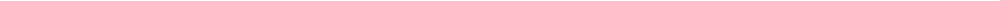

	  

 

  
  
  
  
  

Hey guys, my name is Febrian. Honestly I don't know what should I put in here, but you can see my previous project below.

### Hackathon Projects

<table>
  <tr>
    <td width="50%" valign="top">
      <h4>🏆 <a href="https://github.com/AganFebro/neoland">neoland</a></h4>
      
<em>NFT marketplace built from scratch on CARV SVM Network</em>

      
<strong>Wins:</strong> 3rd Team's Choice • 1st Community Favorite

      

        
        
        
      

      

    </td>
    <td width="50%" valign="top">
      <h4>⚡ <a href="https://github.com/AganFebro/paylazor">paylazor</a></h4>
      
<em>A plug-n-play UI widget built on top of LazorKit SDK</em>

      
<strong>Status:</strong> TBA

      

        
        
      

    </td>
  </tr>
</table>

### Personal Projects

<table width="100%">
  <tr>
    <td colspan="2"></td>
  </tr>
  <tr>
    <td width="50%" valign="top">
      <h4>⛏️ <a href="https://github.com/AganFebro/forge-ocr">forge-ocr</a></h4>
      
OCR + auto-mining helper for Roblox "The Forge".

      

    </td>
    <td width="50%" valign="top">
      <h4>🧾 <a href="https://github.com/AganFebro/Kwitansi-Digital">Kwitansi-Digital</a></h4>
      
Android app to print receipts (built with friends).

      

    </td>
  </tr>
  <tr>
    <td width="50%" valign="top">
      <h4>📊 <a href="https://github.com/AganFebro/CARV-Survey">CARV-Survey</a></h4>
      
CARV community survey web app.

      

    </td>
    <td width="50%" valign="top">
      <h4>🏅 <a href="https://github.com/AganFebro/CARV-Gaming-Leaderboard">CARV-Gaming-Leaderboard</a></h4>
      
CARV Indonesia gaming tournament leaderboard.

      

    </td>
  </tr>
  <tr>
    <td width="50%" valign="top">
      <h4>📝 <a href="https://github.com/AganFebro/flask-web">flask-web</a></h4>
      
Simple notes + money management website.

      

    </td>
    <td width="50%" valign="top">&nbsp;</td>
  </tr>
</table>
